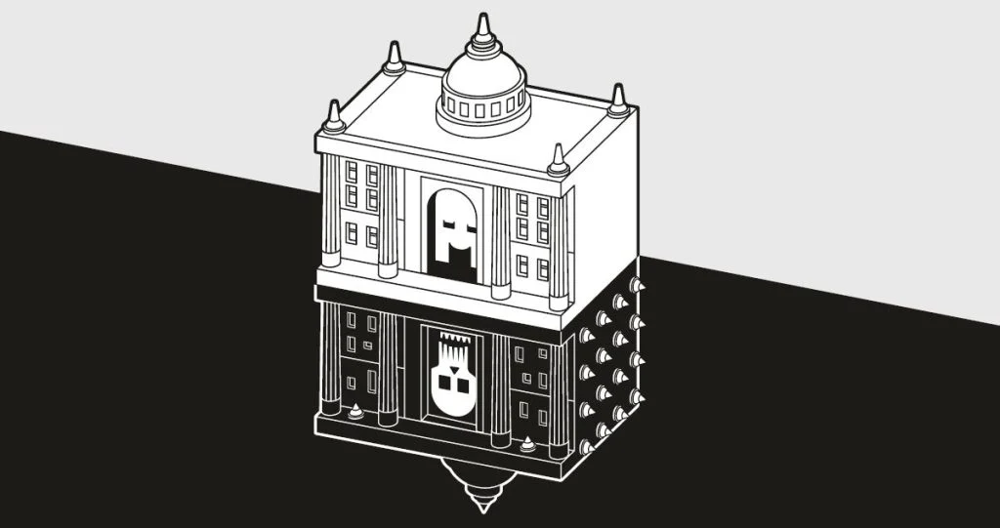
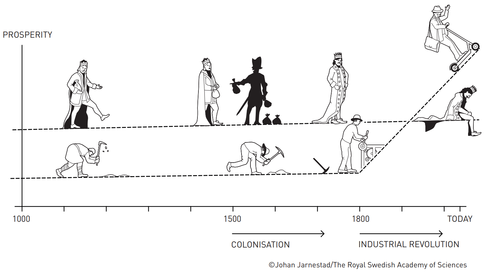

The city of Nogales, on the border between USA and Mexico is cut in half by a fence.

If you stand by this fence and look north, Nogales, Arizona, USA stretches out ahead of you. People of this part are leading better life compared to their Mexican neighbours. They enjoy relatively longer average lifespans and their childrens are receiving high school diplomas. The residents enjoy secure property rights and have trust in the future of their investments. Free elections provide them with the opportunity to replace politicians with whom they are not satisfied.

If you look south instead, you see Nogales, in Sonora, Mexico. Even though this is a relatively wealthy part of Mexico, the residents here are in general poorer than their meighbours on the north side of the fence. Organized crimes keep investments away and corrupt politicians are difficult to remove.

Despite having the same geography, climate, food, and music, and even sharing common ancestors among long-term residents, why do these two halves of the same city have such vastly different living conditions? Why does their degree of satisfaction vary, and why does their happiness depend on which side of the fence they are on? Why do poor countries get poorer while rich countries continue to get richer? Economists have been debating this question for a long time.

    

This year’s Nobel Prize for Economics is awarded to three American economists for the study they conducted on this field which enhanced our understanding on the root causes of why countries fail or succeed. Daron Acemoglu, Simon Johnson and James A. Robinson was awarded the prestigious prize _for their studies of how institutions are formed and affect prosperity_.

According to the Nobel committee, the richest 20 per cent of the world’s countries are now around 30 times richer than the poorest 20 per cent. Moreover, the income gap between the richest and poorest countries is persistent; although the poorest countries have become richer, they are not catching up with the most prosperous. Why? This year’s laureates have found new and convincing evidence for one explanation for this persistent gap – differences in a society’s institutions.

    

In the case of city of Nogales, the decisive difference is not geography or culture, but institutions. The people who live north of the fence live in the USA’s _economic_ system, which gives them greater opportunities to choose their education and profession. Thery are also part of the USA’s _political_ system, which gives them broad political rights. South of the fence, residents are not as fortunate. They live under Mexican economic conditions which limits their opportunities and the Mexican political system which limits their potential to influence legislation.

The laureates have shown that the divided city of Nogales is not an exception, but a part of a clear pattern with roots that go back to the colonial times.

## Colonial institutions

While Europeans colonised large parts of the world the purpose was sometimes to to exploit the indigenous population and extract natural resources. In other cases, the colonisers built inclusive political and economic systems for their own long-term benefit. In this case the institutions are built in more inclusive manner, rather than exploitative.

There were several factors that influenced the type of colony developed by the foreign power. One was population density. The denser the population, the greater the resistance that could be expected. But once defeated, this larger indigenous population offers lucrative opportunities for cheap labour. This resulted in fewer European settlers moving to already densely populated colonies. India under the British rule is an example.

On other side, places that were more sparsely populated offered less resistance to the colonisers and less labour to exploit, so more European colonisers moved to these sparsely populated places. Canada is an example.

## Reversal of fortune

    

